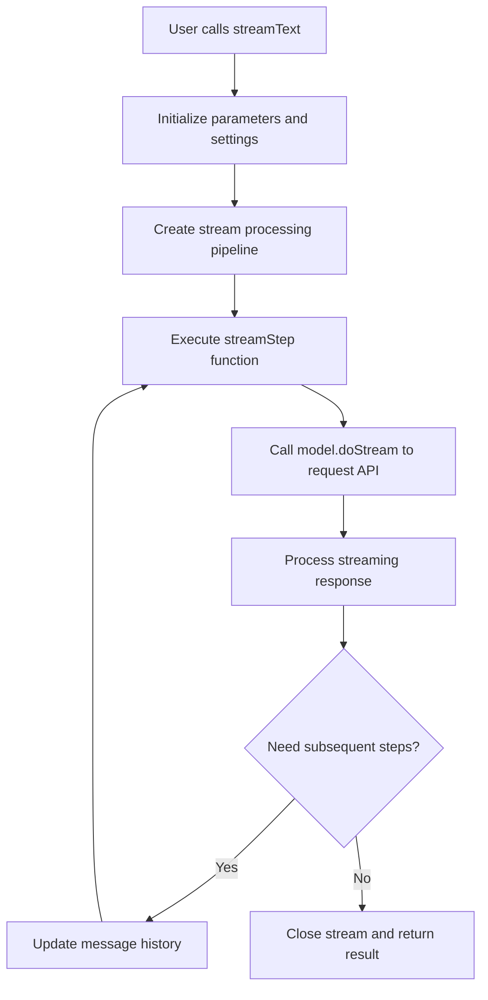
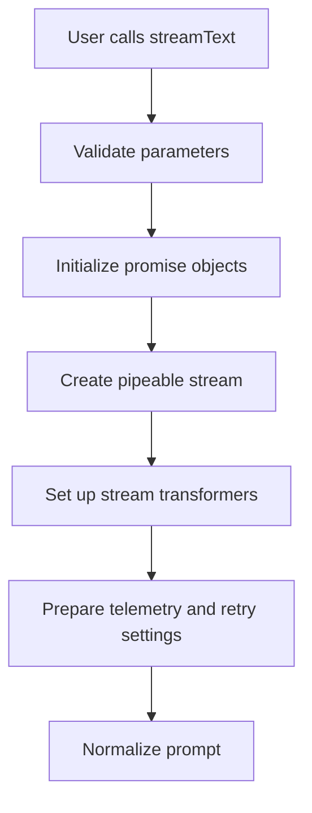
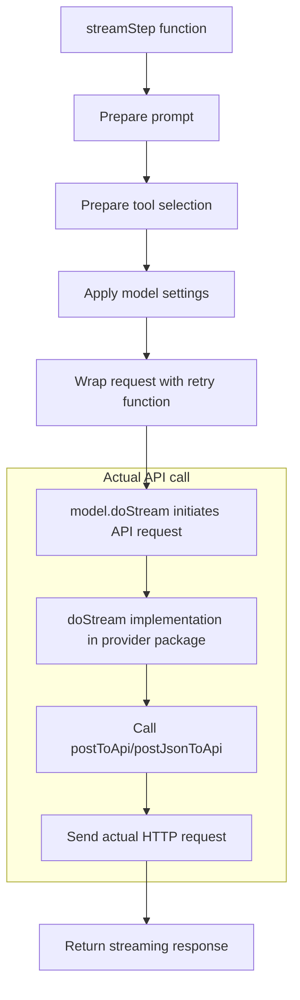
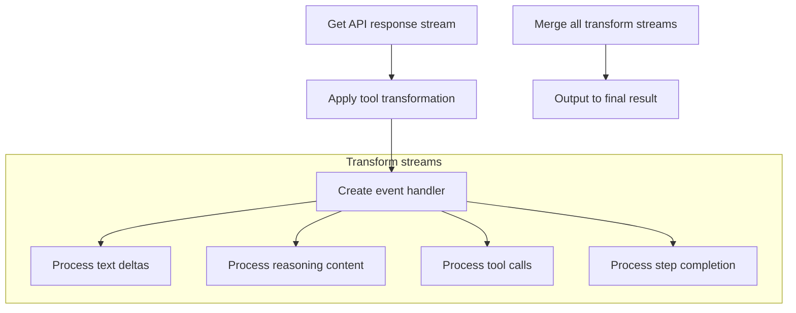
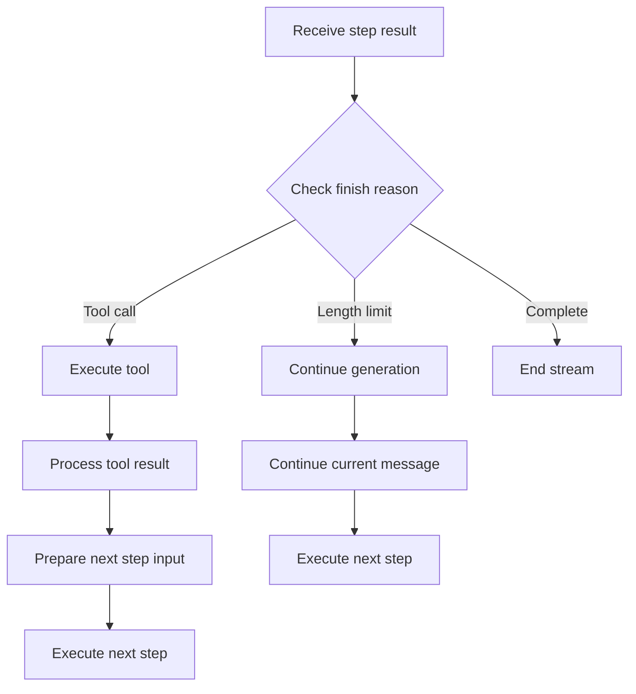
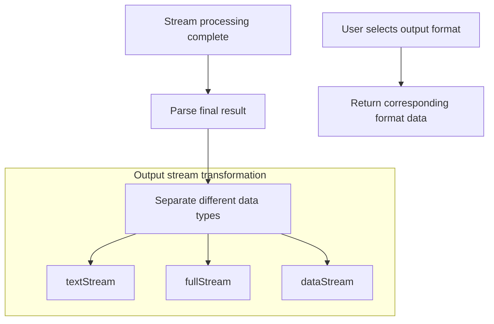

## Background

While developing an AI tool, I used `fetch` to call the AI API myself, and ran into problems under concurrent scenarios. After asking around, I found the open-source community project: https://github.com/vercel/ai , which directly solved my problem. It worked exactly as expected, so I decided to dig into how it's implemented.

## Purpose

Find the implementation of `streamText` in the source code, and then figure out how it supports concurrent requests.

## streamText Feature Analysis

Official API docs: https://sdk.vercel.ai/docs/reference/ai-sdk-core/stream-text

Input it accepts:
- `model`: the language model to use
- `system`: system message that will be part of the prompt
- `tools`: set of tools available for the model to call. Model must support tool calling.
- `prompt`: simple text prompt. `prompt` and `messages` cannot be used together.
- `messages`: list of messages. `prompt` and `messages` cannot be used together.
- and many more...
Output it returns:
- **`textStream`**: a text stream that only returns deltas of generated text. You can use it as an `AsyncIterable` or `ReadableStream`. On error, the stream throws.
- and many more...
There are many other parameters beyond those listed, but our goal is to understand the request-sending logic, so I won't enumerate them all!

## Reading the Source

**Here my goal is to find how requests are sent, data is processed, and content is returned.**

1) Install the source code
```bash
git clone git@github.com:vercel/ai.git
```
After installation, I opened it with Cursor.

2) Find the source file

I know that `streamText` is exported from `ai`, so it must be under the `ai` directory. I found it here: `vercel/ai/packages/ai/core/generate-text/stream-text.ts`. But it turned out to be 1600 lines! I'd rather go play games (just kidding).

Here you can see that it returns an instance of `DefaultStreamTextResult`. The code logic is too complex, so I used AI to help locate the relevant parts:

Here you can see that it calls the model's own `doStream` method to get the result. `streamText` is responsible for preparing request data, then calling `model.doStream()` and processing the returned data.

So we go look at how the model writes its own `doStream` method. I'm looking at OpenAI here, so we go to: `packages/openai/src/openai-chat-language-model.ts`. There we can see:

It calls `postJsonToApi` from `@ai-sdk/provider-utils`. We continue to `packages/provider-utils/src/post-to-api.ts` and can see that `postJsonToApi` returns `PostToApi`, so we look at this method:


This is the method we're looking for. Let's look at it in detail:
It accepts:
- `url`: URL of the target API
- `headers`: request headers
- `body`: request body (contains `content` and `values`)
- `successfulResponseHandler`: handler for successful responses
- `failedResponseHandler`: handler for failed responses
- `abortSignal`: abort signal
- `fetch = getOriginalFetch()`: fetch implementation (defaults to global fetch)
It returns: passes the `response` to `successfulResponseHandler`. That is, it returns the result of executing the `successfulResponseHandler` function.
Then:
1) Sends the HTTP request
2) Extracts and processes response headers
3) Error handling – multiple steps to parse and throw errors
4) Success handling – also uses try-catch to ensure any errors during success processing are thrown
5) Network error handling – handles fetch failures and sets retryable

Code analysis:
- Async non-blocking: uses async/await for async operations, doesn't block the event loop
- Event-driven: uses promises, when the network request completes, the response is handled via event callbacks
- Error handling chain: fine-grained error handling ensures accurate error information on failure, with retry support

## successfulResponseHandler

In the OpenAI code, we saw `createEventSourceResponseHandler` passed as `successfulResponseHandler`. `createEventSourceResponseHandler` is located at `packages/provider-utils/src/response-handler.ts`. The code:


`createEventSourceResponseHandler` is a factory function that creates a handler for processing Server-Sent Events (SSE) format responses. It uses [ReadableStream.PipeThrough()](https://developer.mozilla.org/en-US/docs/Web/API/ReadableStream/pipeThrough) method for data processing:
- `TextDecoderStream`: converts binary to text
- `EventSourceParseStream`: parses SSE format
- `TransformStream`: processes each event data
- Uses [enqueue()](https://developer.mozilla.org/en-US/docs/Web/API/ReadableStreamDefaultController/enqueue) to push a given chunk of data into the associated stream
This streaming approach allows the function to efficiently process large amounts of data without waiting for all data to be received.

Advantages:
- **Non-blocking processing**: uses streaming, doesn't block the event loop
- **Incremental processing**: can immediately process each arriving data chunk without waiting for the full response
- **Memory efficient**: avoids loading the entire response into memory
- **Type safe**: ensures each data chunk matches the expected format via Zod schema
- **Error isolation**: a single data chunk parsing error doesn't affect the entire flow

## stream-text Flowchart



Initialization:


API Request handling:


Stream processing pipeline:


Multi-step processing and tool calling:


Data output processing:


Data flow process:
User input → formatting into a prompt the model understands
API request → uses `postToApi` to issue HTTP request
Streaming return → uses `TransformStream` to process returned data chunks
Transform processing → processes each data chunk according to type (text, tool call, reasoning, etc.)
Result integration → integrates all processed data into the final result

Multi-step processing mechanism:
The code supports multi-step processing, via:
- Handling tool call results and starting new API requests as needed
- Continuing generation when the model output is truncated (finishReason is "length")
- Maintaining message history, using the output of previous steps as part of the input for subsequent steps
This design enables the SDK to support complex conversation and tool usage scenarios, achieving a more intelligent interactive experience.
